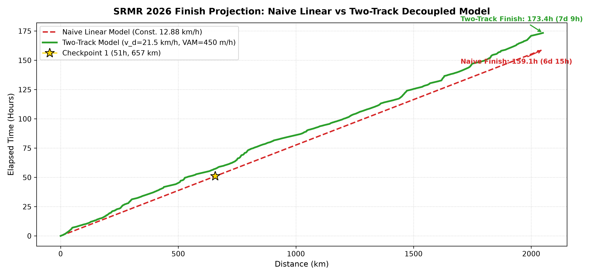
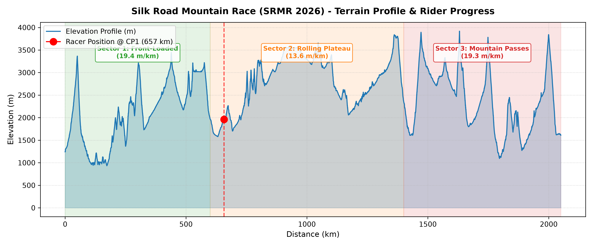

# SRMR 2026 Race Tracker & Predictive Pace Model

A modular Python framework for real-time race tracking, predictive time estimation, and terrain modeling tailored to the **Silk Road Mountain Race (SRMR 2026)**.

---

## 1. External Resources & Links

- **Official Race Website:** [Silk Road Mountain Race 2026](https://www.themountainraces.cc/srmr2026)
- **Live Dot Watching:** [SRMR 2026 MAProgress Tracking](https://srmr2026.maprogress.com/)
- **Official Podcast:** [The Mountain Races Podcast on Spotify](https://open.spotify.com/show/36v8Hy0VofuPnfapp8ZOD1)
- **Course GPX Route Source:** [RideWithGPS Route #53318000](https://ridewithgps.com/routes/53318000)
- **Josh Ibbett's YouTube Channel:** [Josh Ibbett on YouTube](https://www.youtube.com/@joshibbett)

---

## 2. Race Projections & Visual Analysis

### Model Comparison & Finish Time Projection


### Course Elevation & Rider Progress Profile


---

## 3. The Story: Why Linear Speed Extrapolation Fails

At Checkpoint 1 (51 hours elapsed, 657 km completed, +9,200 m elevation gain), a racer holds a naive average speed of **12.88 km/h**. A simple linear extrapolation ($T = D / v_{\text{avg}}$) predicts a finish in **160 hours (6 days, 16 hours)**.

However, linear extrapolation fails because the course topography is severely back-loaded with 6 major high-altitude passes:
- **0–600 km:** ~15.0 m/km climbing density (front-loaded climbs)
- **600–1,400 km:** ~10.5 m/km climbing density (fast rolling plateau)
- **1,400–2,062 km:** ~28.5–30.0 m/km climbing density (high mountain passes up to 3,900 m)

### The Two-Track Model Hook (Naismith / Minetti Reductionism)

We decouple the route into independent horizontal rolling work and vertical climbing ascent:

$$T = T_{\text{distance}} + T_{\text{climb}} = \frac{D}{v_0} + \frac{H_{\text{gain}}}{VAM}$$

Where:
- $v_0 \approx 21.5\text{ km/h}$ (Calibrated flat/rolling speed)
- $VAM \approx 450\text{ m/h}$ (Vertical Ascent Meters per hour)

### Projected Winner Finish Time

| Component | Calculation | Time |
| :--- | :--- | :---: |
| **Horizontal Track ($T_{\text{distance}}$)** | $2,062\text{ km} \div 21.5\text{ km/h}$ | **95.9 hours** |
| **Vertical Track ($T_{\text{climb}}$)** | $36,490\text{ m} \div 450\text{ m/h}$ | **81.1 hours** |
| **Total Estimated Race Time** | $95.9\text{ h} + 81.1\text{ h}$ | **177.0 hours (~7d 9h)** |

- **Predicted Final Average Speed:** **11.65 km/h** (down from the naive 12.88 km/h)
- **Remaining Time from km 657:** **126 hours (~5 days, 6 hours)**

👉 **[Read the Full Mathematical Story & Deep-Dive](docs/two_track_model_story.md)**

---

## 4. Roadmap

- **[Thermoregulatory & Altitude Temperature Coupling Model](docs/thermoregulatory_altitude_model.md)** — Advanced physiological energetics extension modeling altitude-dependent ambient temperature $T(h)$, metabolic thermoregulation power overhead $P_{\text{thermo}}(T)$, and mechanical power coupling via Kirchhoff circuit analogy (focusing on external environmental factors).

---

## 5. Codebase Architecture

```
srmr2026/
├── data/
│   ├── gpx/
│   │   └── Silk_Road_Mountain_Race_2026.gpx   # Official course GPX track
│   └── checkpoints.json                       # Racer checkpoint history
│
├── docs/
│   ├── assets/
│   │   ├── elevation_profile.png              # Terrain & rider position plot
│   │   └── model_comparison_projection.png   # Naive vs Two-Track finish curve
│   ├── two_track_model_story.md               # Full mathematical narrative doc
│   └── thermoregulatory_altitude_model.md     # Thermoregulatory & altitude model
│
├── src/
│   ├── __init__.py
│   ├── gpx_parser.py                          # GPX parsing & sector analysis
│   ├── models.py                              # NaiveLinearModel & TwoTrackModel
│   ├── calibration.py                         # Bounded least-squares optimizer
│   ├── generate_plots.py                      # Matplotlib plot generator
│   ├── thermo_model.py                        # Thermoregulatory & altitude model
│   └── reporter.py                            # Rich CLI tables
│
├── tests/
│   ├── test_gpx_parser.py                     # Parser unit tests
│   ├── test_models.py                         # Model unit tests
│   └── test_thermo_model.py                   # Thermo model unit tests
│
├── main.py                                    # CLI entrypoint
├── requirements.txt                           # Dependencies
└── README.md
```

---

## 6. Quickstart & CLI Commands

### Environment Setup
```bash
python3 -m venv .venv
source .venv/bin/activate
pip install -r requirements.txt
```

### CLI Commands
```bash
# 1. Summarize course terrain sectors
python main.py track --gpx data/gpx/Silk_Road_Mountain_Race_2026.gpx

# 2. Log a checkpoint and compare model projections
python main.py checkpoint --time "2d 3h" --dist 657 --ele 9200

# 3. View current race status summary
python main.py summary

# 4. Re-generate visual plots
python src/generate_plots.py

# 5. Run test suite
pytest -v
```
